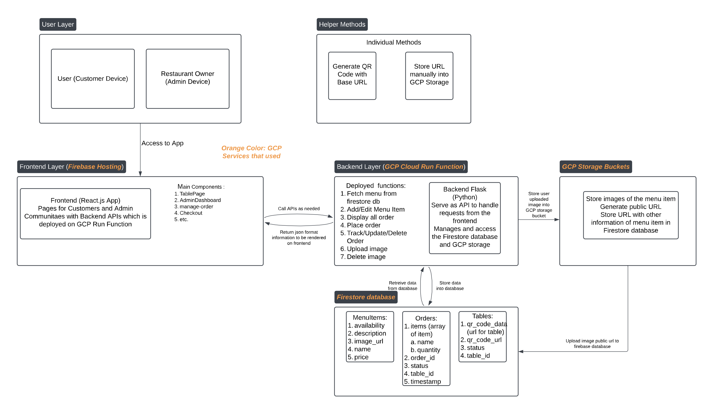

# CS1660-CloudComputing Final Project
**GitHub Repo Url:** https://github.com/haoshenwu22/CS1660-CloudComputing
## **QR Code Restaurant Ordering System**

This project is a comprehensive **QR Code Ordering System** designed for restaurants to streamline their ordering process. It enables customers to browse the menu, place orders, track order statuses, and check out directly from their tables using a mobile-friendly web interface. Administrators have full control over the system via an admin dashboard to manage menu items and monitor or update customer orders.
## **Team Pinch Hitter:**
**Members:**  
- Haoshen Wu  
- Peizhao Mei  

### **Responsibilities**  

- **Haoshen Wu:**  
   Primarily responsible for the **backend development**, including:
   - Implementing Google Cloud Functions to handle API endpoints for menu management, order processing, and image management.
   - Setting up and managing the database in Google Cloud Firestore.
   - Configuring Google Cloud Storage for image hosting.

- **Peizhao Mei:**  
   Primarily responsible for the **frontend development**, including:
   - Designing and developing the React-based web interface for both customers and administrators.
   - Implementing user-friendly features like dynamic menu rendering, order tracking, and checkout functionality.

- **Collaboration:**  
   Both team members collaborated closely on:
   - Setting up seamless communication between different layers of the system, including the **user interface (frontend)**, **backend API**, and **database**.
   - Testing and debugging the integrated system to ensure smooth functionality and scalability.

  
---

## **GCP Services Used**

1. **Google Cloud Functions:**
   - Handles backend logic for menu, order, and image management with endpoints for CRUD operations.
   - Deployed as serverless functions to ensure scalability and efficiency.

2. **Google Cloud Firestore:**
   - Acts as the central database for storing menu items, orders, and related metadata.
   - Provides real-time updates and robust data management.

3. **Google Cloud Storage:**
   - Stores and serves menu item images uploaded by administrators.
   - Ensures fast, secure, and scalable image hosting.

4. **Firebase Hosting:**
   - Hosts the React-based frontend application, providing a responsive and user-friendly interface.
   - Ensures quick deployments and global availability.

---

## **Automation Deployment**

Every push to this repository triggers the **`firebase-deploy.yml`** GitHub Actions workflow. This automation:

- Builds the latest version of the frontend application.
- Deploys the optimized build to Firebase Hosting.
- Ensures the deployed app always reflects the most recent changes.

## **Architectural Design Description**

### **Frontend**
- **Technology**: React.js
- **Role**:
  - Provides a user interface for customers and admin users.
  - Manages state with React hooks to handle menu items, orders, and statuses.
  - Communicates with the backend using Axios for API calls.
- **Deployed on**: _Firebase Hosting_  
(https://endless-bounty-433922-g4.web.app/admin/dashboard)  
(https://endless-bounty-433922-g4.web.app/table/table1) table range from 1 to 8
- **Main Components**:
  - `TablePage.js`: Displays the menu and current orders for customers.
  - `Checkout.js`: Handles order checkout and displays total prices.
  - `AdminDashboard.js`: Allows admins to manage menu items (add, edit, delete).
  - `ManageOrders.js`: Allows admins to view and update order statuses and delete orders.

### **Backend**
- **Technology**: Flask (Python) deployed as _Google Cloud Functions_
- **Role**:
  - Serves as an API to handle requests from the frontend.
  - Manages the Firestore database and Google Cloud Storage for image files.
- **API URL**: https://us-central1-endless-bounty-433922-g4.cloudfunctions.net/restaurant-api
- **Endpoints**:
  - **Menu Management**:
    - `/menu` (GET, POST)
    - `/menu/<menu_id>` (PUT, DELETE)
  - **Order Management**:
    - `/order` (POST)
    - `/order/<order_id>` (PUT)
    - `/order-status/<table_id>` (GET)
    - `/orders` (GET)
    - `/delete-order/<order_id>` (DELETE)
  - **Image Upload and Deletion**:
    - `/upload-image` (POST)
    - `/delete-image/<filename>` (DELETE)
- **Deployed on**: _Google Cloud Functions_

### **Database**
- **Technology**: _Google Firestore_
- **Role**:
  - Stores menu items with fields: `name`, `price`, `description`, `availability`, `image_url`.
  - Stores orders with fields: `table_id`, `items`, `status`, `order_id`, `timestamp`.
  - Stores tables with fields: `qr_code_data`, `qr_code_url`, `status`, `table_id`.

### **File Storage**
- **Technology**: _Google Cloud Storage_
- **Role**: Stores menu item images and provides public URLs for frontend display.

---

## **Architectural Diagram**

[View the Architectural Diagram PDF](architecturalDiagram.pdf)  
Below is the flow of the system:

1. **Frontend**: Firebase Hosting (React.js)
   - Communicates with the backend API.

2. **Backend**: Google Cloud Functions (Flask)
   - Interacts with Firestore and Cloud Storage.

3. **Database**: Firestore
   - Stores menu and order data.

4. **File Storage**: Cloud Storage
   - Stores images uploaded for menu items.

---
## **Workflow for Customer and Admin Sides**

### **Customer Workflow**

1. **QR Code Scanning :**
    - Costumer scan the qrcode on their table.
    - Here is the qr code for table 1 (rest of the qrcode are in repo directory) 
    
2. **Menu Browsing:**
   - The customer navigates to their table page (`/table/{table_id}`).
   - A GET request to `/menu` fetches all menu items from Firestore.
   - Menu items are displayed with images, descriptions, availability, and price.

3. **Place Order:**
   - The customer selects menu items and specifies quantities.
   - Clicking "Place Order" sends a POST request to `/order` with the table ID and order details.
   - Orders are stored in Firestore under the `Orders` collection.

4. **Order Tracking:**
   - The customer clicks "Track Orders" to see the status of their orders.
   - A GET request to `/order-status/{table_id}` fetches all orders for the table.
   - Orders with statuses (e.g., Pending, In Progress, Completed) are displayed.

4. **Checkout:**
   - The customer navigates to the "Checkout" page (`/table/{table_id}/checkout`).
   - All orders for the table are fetched, and the total amount is calculated based on price and quantity.
   - Clicking "Checkout" sends DELETE requests to `/delete-order/{order_id}` for every order on that table.
   - After deletion, the customer is redirected back to the menu, ready for the next costumer to order from step 1.

---

### **Admin Workflow**

1. **Dashboard:**
   - The admin accesses the dashboard (`/admin/dashboard`).
   - A GET request to `/menu` retrieves all menu items, which are displayed with images. This is easy for the owner/admin to see what item is currently on the menu. 

2. **Menu Management:**
   - **Add Menu Item:**
     - The admin navigates to "Add Menu Item" (`/admin/add`).
     - A form is filled out, including an image upload.
     - The image is uploaded to Cloud Storage, and its URL is saved in Firestore along with menu details.
   - **Edit Menu Item:**
     - The admin selects a menu item to edit (`/admin/edit`).
     - Fields are updated, and a new image can be uploaded if required.
     - Changes are saved to Firestore.
   - **Delete Menu Item:**
     - The admin clicks "Delete" for a specific menu item on the dashboard.
     - The image is deleted from Cloud Storage, and the item is removed from Firestore.

3. **Order Management:**
   - The admin navigates to "Manage Orders" (`/admin/orders`).
   - All orders are fetched via a GET request to `/orders` and displayed.
   - **Update Status:**
     - Admin updates order statuses (Pending → In Progress → Completed) and clicks "Confirm" to save changes.
   - **Delete Order:**
     - Admin can delete any order via a DELETE request to `/delete-order/{order_id}`.

---

### **Customer and Admin Relationship**

- **Menu Synchronization:**
  - Customers and admins interact with the same menu items from Firestore. Admin changes (add, edit, delete) reflect immediately for customers.

- **Order Workflow:**
  - Orders placed by customers appear on the admin's "Manage Orders" page. Admins can update statuses, which customers see in their "Track Orders."
